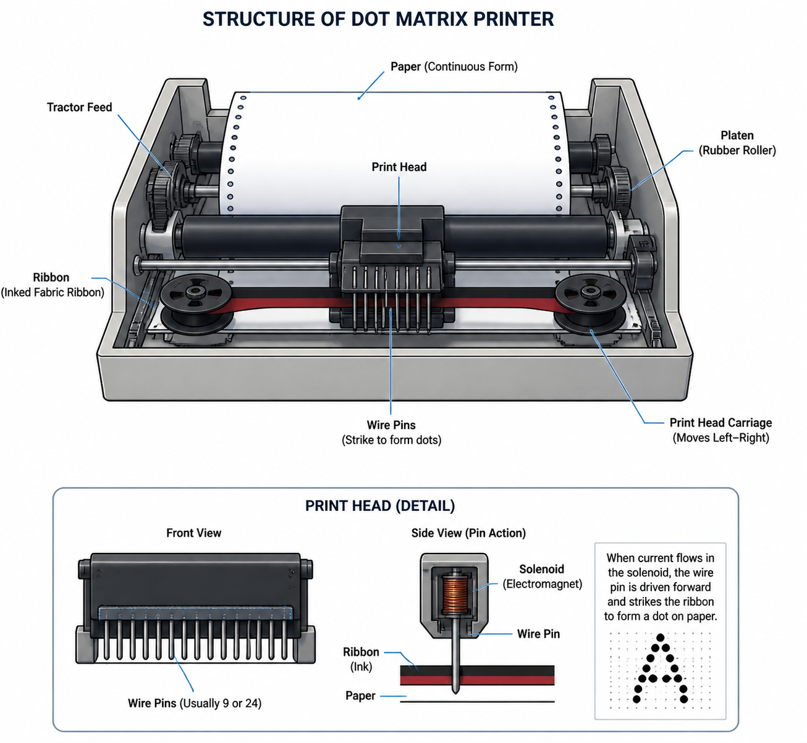
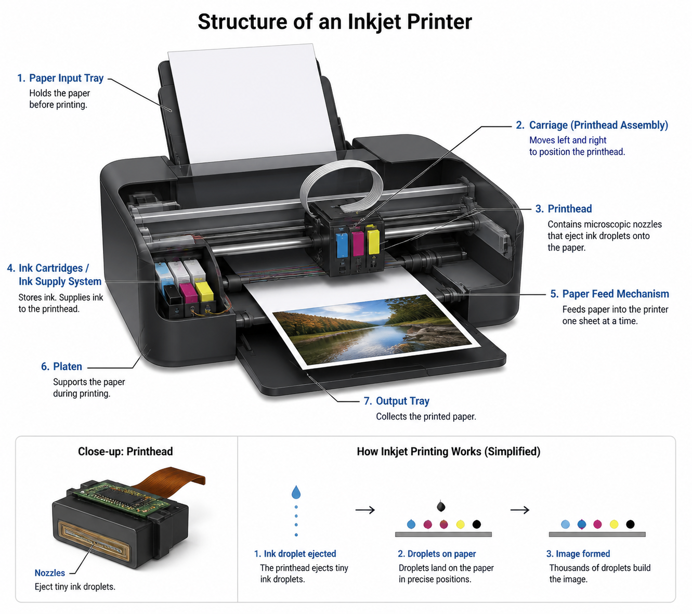
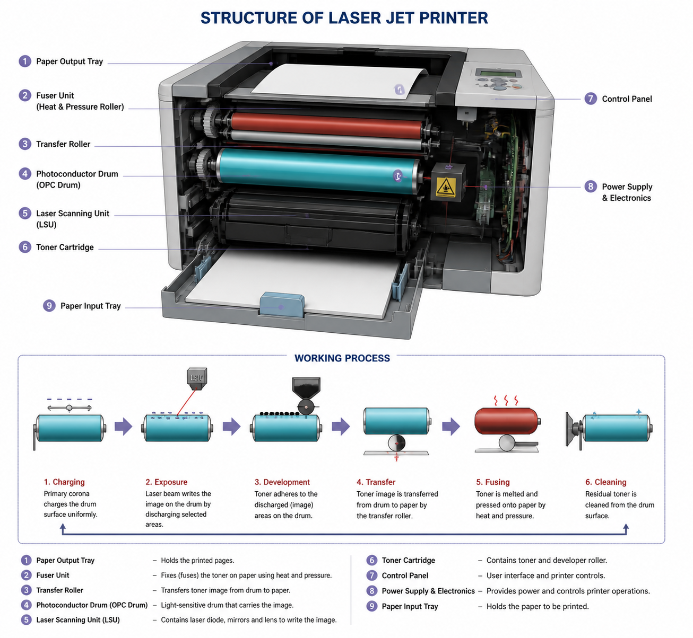

# 🖨️ Dot Matrix Printer

### What is a Dot Matrix Printer?
A Dot Matrix Printer is an impact printer that prints characters using small dots made by pins.

### Main Parts
- **Print Head** → Contains small pins  
- **Pins** → Usually 7, 9, 14, 18, or 24 pins  
- **Ribbon** → Inked ribbon used for printing  
- **Motor & Belt** → Move the print head left and right  

### How It Works
- Computer sends characters to the printer.  
- Printer converts characters into dot patterns.  
- Pins hit the ink ribbon.  
- Ribbon presses ink onto paper.  
- Dots combine to form letters and symbols.  

### Important Points
- Pins are arranged in a vertical column.  
- Only one column of dots is printed at a time.  
- The print head moves back and forth along a rail.  
- A motor drives the belt to move the print head.  
- More pins = Better print quality.  

### Common Pin Types

| Pins | Print Quality |
|------|---------------|
| 9 Pins | Normal quality |
| 24 Pins | Better quality |

### Advantages
- Cheap printing cost  
- Can print multi-copy forms  
- Durable  

### Disadvantages
- Noisy  
- Slow printing  
- Lower quality compared to laser or inkjet printers  

---

# 🖨️ Ink-Jet Printer

### Definition
An Ink-Jet Printer is a non-impact printer that prints text and images by spraying tiny droplets of ink onto paper through small nozzles.

### Main Parts
- **Print Head** → Contains many tiny nozzles  
- **Nozzles** → Spray ink droplets onto paper  
- **Ink Cartridge** → Stores ink  
- **Motor & Belt** → Move the print head  
- **Rail/Carriage** → Path for print head movement  
- **Driver Circuit** → Controls ink spraying  
- **Flexible Cable** → Connects print head with control unit  

### Working Principle
- The computer sends characters or images to the printer.  
- The printer converts them into dot patterns.  
- Signals are sent to the nozzle driver circuits.  
- The driver circuit creates high-energy pulses.  
- Heat creates a tiny bubble inside the nozzle.  
- The bubble bursts and sprays a small droplet of ink onto the paper.  
- Thousands of tiny droplets combine to form text and images.  
- The print head moves back and forth using a motor and belt.  
- The nozzle cools quickly and becomes ready for the next pulse.  

### Advantages
- High print quality  
- Can print color images  
- Quiet operation  
- Faster than dot-matrix printer  
- Compact and lightweight  

### Disadvantages
- Ink is expensive  
- Ink can dry out if unused  
- Printing cost is higher  
- Paper quality affects print quality  
- Slower than laser printer for large printing tasks  

---

# 🖨️ Laser-Jet Printer

### Definition
A Laser-Jet Printer is a non-impact printer that uses a laser beam and toner powder to print high-quality text and images on paper.

### Main Parts
- **Laser Beam** → Creates image on drum  
- **Photosensitive Drum** → Holds electrostatic image  
- **Toner Cartridge** → Contains toner powder  
- **Hot Rollers (Fuser Unit)** → Melt toner onto paper  
- **Paper Feed System** → Moves paper  
- **Electronic Control Unit** → Controls printing process  

 ### Working Principle
- A laser printer works similarly to a photocopier machine.  
- The computer sends text or image data to the printer.  
- A laser beam creates an electrostatic image on the photosensitive drum.  
- The drum rotates through toner powder.  
- Toner particles stick to the charged image on the drum.  
- The drum presses the toner image onto paper.  
- The paper passes through hot rollers.  
- Heat and pressure permanently fuse the toner onto the paper.  
- Finally, the printed paper comes out.  

### Important Points
- Uses laser technology instead of ink  
- Uses toner powder, not liquid ink  
- Drum size matches paper size  
- Print quality is less affected by paper quality  
- Common resolution: 600 dpi 

### Advantages
- Very high print quality  
- Fast printing speed  
- Quiet operation  
- Prints large volumes efficiently  
- Print does not smudge easily  

### Disadvantages
- Expensive printer  
- Toner replacement cost is high  
- Larger in size  
- Higher power consumption compared to ink-jet printers  

---